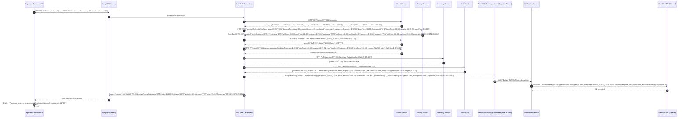
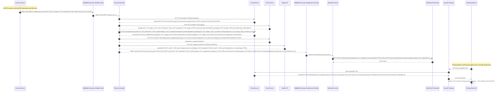
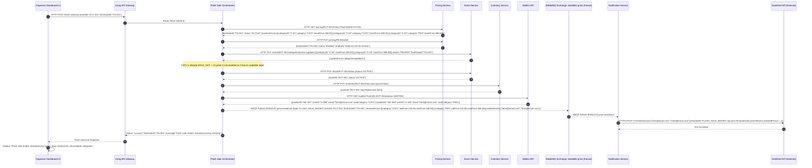

# You are an expert in Cloud Architecture Patterns and distributed systems design.

Key Principles:

- Design for failure
- Decouple components
- Elasticity (Scale out/in)
- Event-driven communication
- Managed services over self-managed

Common Patterns:

- Microservices: Independent, loosely coupled services
- Event-Sourcing: Store state changes as a sequence of events
- CQRS (Command Query Responsibility Segregation): Separate read and write models
- Strangler Fig: Gradually replace legacy systems
- Circuit Breaker: Prevent cascading failures
- Bulkhead: Isolate failures to specific pools
- Sidecar: Offload cross-cutting concerns (logging, proxy)
- Ambassador: Helper service for network calls

Scalability Patterns:

- Sharding: Partition data horizontally
- Caching: Look-aside, Write-through
- Load Balancing: Distribute traffic
- Queue-Based Load Leveling: Buffer requests

Best Practices:

- Use asynchronous communication (Queues/Topics)
- Implement idempotency
- Design for observability (Correlation IDs)
- Automate recovery
- Test resiliency (Chaos Engineering)

Task:
Based on our conversation history, fix those gaps you mentioned, analyse the proposal template in detail and provide me with the full, unabridged write-up that includes the Microservice Interaction Diagrams, Write-ups, External Services and Beyond the Labs section for the second user scenario Organiser Launches Flash Sale with Dynamic Pricing (Orchestration + Broadcast) listed above. Focus solely on this scenario and do not add anything more.

Take Note:
Omit the fan/organiser and start with Ticketing System UI/Organiser Dashboard UI
The interaction steps should be as detailed as possible
The UI should display a final success state after the entire backend flow completes for each diagram
In the mermaid diagrams, for RabbitMQ, display the connections as a dotted line stating AMQP
Provide the API docs etc.
Double-check and fact-check that your implementation is correct

Below is the complete revised write-up for **Scenario 2 only**, structured to match the proposal template's emphasis on detailed interaction diagrams, communication patterns, URL paths, binding keys, schemas, and API details. All four gaps identified in the preceding review have been corrected: the "LIVE" ambiguity is resolved, the fanout exchange is used only where justified, the waitlist retrieval step is inserted in both 2A and 2B, a single Flash Sale Orchestrator handles both launch and end, and all responses route back through Kong.[^1][^2]

***

## Solution Scoping

### User Scenario Implemented Here

**Scenario 2: Organiser Launches Flash Sale with Dynamic Pricing (Orchestration + Broadcast)**

### Scenario Summary

Scenario 2 has three parts:

1. **Step 2A — Flash sale launched:** Organiser Dashboard UI triggers a flash sale. The Flash Sale Orchestrator configures discounted prices, activates the sale, retrieves all waiting fans, and broadcasts the price change to all consumers via a fanout exchange. Waitlisted fans receive an email. The Organiser Dashboard UI shows a final success state.
2. **Step 2B — Dynamic price escalation:** When a seat category sells out during the flash sale, Inventory Service automatically publishes a `category.sold_out` event. The Pricing Orchestrator consumes this, computes escalated prices for remaining categories, retrieves the waitlist for those categories, and broadcasts the updated prices. The Ticketing System UI shows updated prices on the next poll.
3. **Step 2C — Flash sale ended:** The organiser ends the sale from Organiser Dashboard UI. The same Flash Sale Orchestrator reverts all prices to baseline, deactivates the sale, notifies remaining waitlisted fans, and returns a final success state to the UI.

### Design Assumptions

- The **same Flash Sale Orchestrator** handles both `POST /flash-sale/launch` (2A) and `POST /flash-sale/end` (2C). These are two operations on the same service, not two separate orchestrators.
- **"Flash sale pricing is now active"** means ticket prices for that event are discounted for a limited window. The concert event date itself is unaffected and may be weeks or months away.
- The `ticketblitz.price` **fanout exchange** is used exclusively for `price.broadcast`. All other messages in the system use the `ticketblitz` topic exchange with explicit binding keys. Fanout is justified here because **two independent consumers** — Notification Service and the Ticketing System UI (via polling) — must receive the same price update simultaneously without the publisher knowing or caring how many consumers exist.
- **Pricing Service** is a new atomic service introduced in Scenario 2. It acts as the calculation engine for flash sale discounts and escalations, and owns the `flash_sales` and `price_changes` audit tables. It does not own `seat_categories`; that is owned by Event Service.
- **Event Service** is a new atomic service introduced in Scenario 2. It owns `events` and `seat_categories` including the current effective price per category.
- **Inventory Service, Waitlist API, and Notification Service** are reused from Scenario 1 with new endpoints added.
- The Ticketing System UI shows updated prices through periodic polling of `GET /pricing/{eventID}` through Kong, rather than a persistent WebSocket connection. This keeps the implementation simple and consistent with the polling pattern used in Scenario 1.
- All UI-facing HTTP requests enter and exit through Kong. No service responds directly to the UI.

***

## Step 2A — Flash Sale Launch

### Microservice Interaction Diagram — Step 2A: Organiser Launches Flash Sale

### Interaction Steps — Step 2A

1. **Trigger flash sale launch:** Organiser Dashboard UI sends `HTTP POST /flash-sale/launch` to Kong with `{eventID, discountPercentage:50, durationMinutes:120}`.
2. **Route through gateway:** Kong authenticates the request using the organiser's API key and routes it to Flash Sale Orchestrator.
3. **Retrieve current category prices:** Flash Sale Orchestrator calls `GET /event/{eventID}/categories` on Event Service to retrieve the current base prices for all seat categories. This is necessary so Pricing Service has the correct baseline to compute discounted values.
4. **Configure flash sale pricing:** Flash Sale Orchestrator calls `POST /pricing/flash-sale/configure` on Pricing Service. Pricing Service records the new `flash_sales` row, computes the discounted price for each category using the supplied discount percentage, logs each price change to `price_changes`, and returns the full set of `{categoryID, oldPrice, newPrice}` values along with a generated `flashSaleID` and `expiresAt` timestamp.
5. **Update event status:** Flash Sale Orchestrator calls `PUT /event/{eventID}/status` with `{status:"FLASH_SALE_ACTIVE"}`. Event Service updates the event row so any downstream service checking event state can correctly gate booking eligibility.
6. **Apply discounted prices:** Flash Sale Orchestrator calls `PUT /event/{eventID}/categories/prices` with the full set of category price updates returned by Pricing Service. Event Service updates each `seat_categories.price` row so the Ticketing System UI's next poll of `GET /pricing/{eventID}` returns the discounted prices.
7. **Activate flash sale inventory:** Flash Sale Orchestrator calls `PUT /inventory/{eventID}/flash-sale {active:true}`. Inventory Service records the flash sale flag so reservation logic can enforce flash sale rules, such as limiting quantity per user if required.
8. **Retrieve waitlisted fans:** Flash Sale Orchestrator calls `GET /waitlist?eventID=EVT-301&status=WAITING` on Waitlist API and receives the full list of `{waitlistID, userID, email, seatCategory}` entries. This list is used to populate the `waitlistEmails` field in the outgoing broadcast message so Notification Service can target them directly.
9. **Publish price broadcast to fanout exchange:** Flash Sale Orchestrator publishes `price.broadcast` to the `ticketblitz.price` fanout exchange. Because this is a fanout exchange, all queues bound to it receive the message simultaneously without routing key filtering.
10. **Consume broadcast:** Notification Service receives the message from its dedicated queue bound to the fanout exchange.
11. **Send flash sale notification emails:** Notification Service iterates through `waitlistEmails` and calls SendGrid `POST /v3/mail/send` using the `FLASH_SALE_LAUNCHED` template, passing `{eventName, discountPercentage, expiresAt}` as dynamic template data.
12. **SendGrid confirms delivery:** SendGrid returns `202 Accepted`.
13. **Return final response to UI:** Flash Sale Orchestrator returns `{status:"success", flashSaleID, activePrices, expiresAt}` to Kong, which forwards it to the Organiser Dashboard UI.
14. **Display final success state:** Organiser Dashboard UI displays **"Flash sale pricing is now active. 50% discount applied. Expires at 4:54 PM."**

***

## Step 2B — Dynamic Price Escalation

This step is triggered automatically by inventory events, not by a user action. The Ticketing System UI is the affected client and reflects updated prices on the next poll. The project requires scenarios that handle business exception situations beyond simple UI-to-service interactions, and automatic price escalation when a category sells out is a strong example of this.[^2]

### Microservice Interaction Diagram — Step 2B: Category Sells Out → Prices Escalate → UI Updated

### Interaction Steps — Step 2B

1. **Category sold-out detected:** Inventory Service identifies that all `CAT1` seats have reached `SOLD` status during the active flash sale. This is a state transition triggered as part of Scenario 1's booking confirmation flow when the last CAT1 hold is confirmed.
2. **Publish sold-out event:** Inventory Service publishes `category.sold_out` to the `ticketblitz` topic exchange with binding key `category.sold_out` and payload `{eventID, category, flashSaleID, soldAt}`.
3. **Consume sold-out event:** Pricing Orchestrator receives the message from its dedicated queue bound to the `ticketblitz` topic exchange with binding key `category.sold_out`.
4. **Verify active flash sale:** Pricing Orchestrator calls `GET /pricing/{eventID}/flash-sale/active` on Pricing Service to confirm a flash sale is still running and retrieve its configuration, including the `escalationPercentage`. If no flash sale is active, the orchestrator discards the message and takes no further action.
5. **Retrieve all categories and current prices:** Pricing Orchestrator calls `GET /event/{eventID}/categories` on Event Service to get the current price and status of all categories so it can identify which ones are still available and eligible for escalation.
6. **Compute escalated prices:** Pricing Orchestrator calls `POST /pricing/escalate` on Pricing Service with the sold-out category and all remaining available categories. Pricing Service applies the configured `escalationPercentage` (20%) to each remaining category's current price, records each change to `price_changes` with `reason:"ESCALATION"`, and returns the set of updated prices.
7. **Apply escalated prices to Event Service:** Pricing Orchestrator calls `PUT /event/{eventID}/categories/prices` on Event Service with the new prices for each remaining category. Event Service updates `seat_categories.price` so the next fan's price check reflects the escalation.
8. **Retrieve waitlisted fans for remaining categories:** Pricing Orchestrator calls `GET /waitlist?eventID=EVT-301&status=WAITING` on Waitlist API. The waitlist entries include the `seatCategory` field, so Notification Service can personalise each email with the relevant updated price for that fan's chosen category.
9. **Publish escalation broadcast to fanout exchange:** Pricing Orchestrator publishes `price.broadcast` to the `ticketblitz.price` fanout exchange with `type:"PRICE_ESCALATED"`, the `soldOutCategory`, `updatedPrices`, and `waitlistEmails`.
10. **Deliver to Notification Service:** Notification Service receives the message from its queue bound to the fanout exchange.
11. **Send escalation notification emails:** Notification Service calls SendGrid using the `PRICE_ESCALATED` template, targeting only the waitlisted fans whose categories still have availability. This avoids emailing fans already waiting for the now-sold-out category.
12. **SendGrid confirms delivery:** SendGrid returns `202 Accepted`.
13. **UI reflects updated prices on next poll:** Ticketing System UI polls `GET /pricing/{eventID}` through Kong. Pricing Service returns the current effective prices including the newly escalated values and the `SOLD_OUT` flag for CAT1.
14. **Display final updated price state:** Ticketing System UI displays **"CAT1 Sold Out. Remaining prices updated — CAT2: \$100.80 | PEN: \$232.80."**

***

## Step 2C — Flash Sale Ended

The same Flash Sale Orchestrator that handled `POST /flash-sale/launch` in Step 2A handles `POST /flash-sale/end` here. Using a single orchestrator for the full flash sale lifecycle is correct because both actions operate on the same `flash_sales` record and involve the same downstream services.[^2]

### Microservice Interaction Diagram — Step 2C: Organiser Ends Flash Sale → Prices Reverted → UI Updated

### Interaction Steps — Step 2C

1. **Trigger flash sale end:** Organiser Dashboard UI sends `HTTP POST /flash-sale/end` to Kong with `{eventID, flashSaleID}`.
2. **Route through gateway:** Kong routes to Flash Sale Orchestrator. This is the same orchestrator that handled `POST /flash-sale/launch` in Step 2A — not a new service.
3. **Retrieve baseline prices from Pricing Service:** Flash Sale Orchestrator calls `GET /pricing/{eventID}/history?flashSaleID=FS-001` to retrieve the original base prices from `price_changes` audit records. This is the authoritative source of pre-sale prices, avoiding any risk of reverting to a wrong value if prices were escalated during the sale.
4. **Mark flash sale as ended:** Flash Sale Orchestrator calls `PUT /pricing/{flashSaleID}/end`. Pricing Service updates `flash_sales.status` to `ENDED` and records `endedAt`.
5. **Revert available category prices:** Flash Sale Orchestrator calls `PUT /event/{eventID}/categories/prices` on Event Service, passing only categories that still have available seats. CAT1 is already sold out so its price is not reverted — there is no inventory to sell at the old price.
6. **Revert event status:** Flash Sale Orchestrator calls `PUT /event/{eventID}/status {status:"ACTIVE"}` so the event reverts to standard booking mode.
7. **Deactivate flash sale inventory flag:** Flash Sale Orchestrator calls `PUT /inventory/{eventID}/flash-sale {active:false}`. Inventory Service removes the flash sale flag so reservation logic returns to standard rules.
8. **Retrieve remaining waitlisted fans:** Flash Sale Orchestrator calls `GET /waitlist?eventID=EVT-301&status=WAITING` on Waitlist API to get fans who are still waiting. These fans need to be informed that prices have reverted so they can decide whether to proceed with booking.
9. **Publish flash sale ended broadcast to fanout exchange:** Flash Sale Orchestrator publishes `price.broadcast` with `type:"FLASH_SALE_ENDED"` to the `ticketblitz.price` fanout exchange.
10. **Deliver to Notification Service:** Notification Service receives the message from its queue.
11. **Send flash sale ended notification emails:** Notification Service calls SendGrid using the `FLASH_SALE_ENDED` template to notify remaining waitlisted fans that standard pricing has been restored.
12. **SendGrid confirms delivery:** SendGrid returns `202 Accepted`.
13. **Return final response to UI:** Flash Sale Orchestrator returns `{status:"success", message:"Flash sale ended. Standard pricing restored."}` to Kong, which forwards it to the Organiser Dashboard UI.
14. **Display final success state:** Organiser Dashboard UI displays **"Flash sale ended. Standard pricing has been restored for all available categories."**

***

## API Docs, External Services, and Beyond the Labs

### Application / UI

| Application / UI Name | Menu Items |
| :-- | :-- |
| Organiser Dashboard UI | Launch Flash Sale, End Flash Sale, View Sales Analytics, Manage Events |
| Ticketing System UI | Browse Events, View Prices (reused from Scenario 1) |

### Atomic Microservices — New for Scenario 2

| Service Name | Operations | Database / Storage | Table Name \& Schema |
| :-- | :-- | :-- | :-- |
| **Event Service** | `[GET] /event/{eventID}`; `[GET] /event/{eventID}/categories`; `[PUT] /event/{eventID}/status`; `[PUT] /event/{eventID}/categories/prices` | `ticketblitz_db` | `events`: `event_id` UUID PK, `name` VARCHAR(200), `venue` VARCHAR(200), `event_date` TIMESTAMPTZ, `total_capacity` INT, `status` VARCHAR(20) CHECK('SCHEDULED','ACTIVE','FLASH_SALE_ACTIVE','CANCELLED','COMPLETED'), `created_at` TIMESTAMPTZ, `updated_at` TIMESTAMPTZ, `deleted_at` TIMESTAMPTZ; `seat_categories`: `category_id` UUID PK, `event_id` UUID, `name` VARCHAR(50), `price` DECIMAL(10,2), `total_seats` INT, `created_at` TIMESTAMPTZ, `updated_at` TIMESTAMPTZ, `deleted_at` TIMESTAMPTZ |
| **Pricing Service** | `[POST] /pricing/flash-sale/configure`; `[GET] /pricing/{eventID}/flash-sale/active`; `[POST] /pricing/escalate`; `[PUT] /pricing/{flashSaleID}/end`; `[GET] /pricing/{eventID}/history`; `[GET] /pricing/{eventID}` | `ticketblitz_db` | `flash_sales`: `flash_sale_id` UUID PK, `event_id` UUID, `discount_percentage` DECIMAL(5,2), `escalation_percentage` DECIMAL(5,2), `start_time` TIMESTAMPTZ, `end_time` TIMESTAMPTZ, `status` VARCHAR(20) CHECK('ACTIVE','ENDED'), `created_at` TIMESTAMPTZ, `updated_at` TIMESTAMPTZ, `deleted_at` TIMESTAMPTZ; `price_changes`: `change_id` UUID PK, `flash_sale_id` UUID, `event_id` UUID, `category` VARCHAR(50), `old_price` DECIMAL(10,2), `new_price` DECIMAL(10,2), `reason` VARCHAR(20) CHECK('FLASH_SALE','ESCALATION','REVERT'), `changed_at` TIMESTAMPTZ, `created_at` TIMESTAMPTZ, `deleted_at` TIMESTAMPTZ |

### Atomic Microservices — Reused from Scenario 1

| Service Name | New Operations Added for Scenario 2 | Notes |
| :-- | :-- | :-- |
| **Inventory Service** | `[PUT] /inventory/{eventID}/flash-sale {active, flashSaleID}` | Activates and deactivates flash sale mode on the event inventory |
| **Waitlist API** | `[GET] /waitlist?eventID=&status=` | New query endpoint for batch retrieval; used by both Flash Sale Orchestrator and Pricing Orchestrator |
| **Notification Service** | Consumes `[FANOUT] price.broadcast` from `ticketblitz.price` exchange in addition to existing `notification.send` | Handles both topic and fanout queues in one pika blocking loop |

### Composite Services

| Service Name | Type | Operations / Trigger | Notes |
| :-- | :-- | :-- | :-- |
| **Flash Sale Orchestrator** | Composite HTTP | `[POST] /flash-sale/launch`; `[POST] /flash-sale/end`; `[GET] /flash-sale/{eventID}/status` | Single orchestrator handles both launch (2A) and end (2C) |
| **Pricing Orchestrator** | Composite AMQP worker | Consumes `[BKEY] category.sold_out` from `ticketblitz` topic exchange | Pure consumer; no HTTP endpoints; triggers 2B escalation flow |

### AMQP Model

| Exchange | Type | Binding Key / Pattern | Publisher | Consumer | Payload |
| :-- | :-- | :-- | :-- | :-- | :-- |
| `ticketblitz` | Topic | `category.sold_out` | Inventory Service | Pricing Orchestrator | `{eventID, category, flashSaleID, soldAt}` |
| `ticketblitz.price` | **Fanout** | N/A | Flash Sale Orchestrator, Pricing Orchestrator | Notification Service | `{type, eventID, flashSaleID, updatedPrices[], revertedPrices[], waitlistEmails[], soldOutCategory?, expiresAt?}` |
| `ticketblitz` | Topic | `notification.send` | Multiple (Scenario 1 reuse) | Notification Service | `{type, email, ...}` |

### Key JSON Payloads

| API / Message | Example Payload |
| :-- | :-- |
| `POST /flash-sale/launch` | `{"eventID":"EVT-301","discountPercentage":50,"durationMinutes":120}` |
| `POST /pricing/flash-sale/configure` | `{"eventID":"EVT-301","discountPercentage":50,"durationMinutes":120,"escalationPercentage":20,"categories":[{"categoryID":"C-01","basePrice":288.00}]}` |
| `POST /pricing/escalate` | `{"eventID":"EVT-301","flashSaleID":"FS-001","soldOutCategory":"CAT1","escalationPercentage":20,"remainingCategories":[{"categoryID":"C-02","category":"CAT2","currentPrice":84.00}]}` |
| `PUT /event/{eventID}/categories/prices` | `{"updates":[{"categoryID":"C-02","newPrice":100.80}],"reason":"ESCALATION","flashSaleID":"FS-001"}` |
| `GET /waitlist?eventID=EVT-301&status=WAITING` response | `[{"waitlistID":"WL-057","userID":"U-099","email":"fan4@email.com","seatCategory":"CAT2"}]` |
| `price.broadcast` launch | `{"type":"FLASH_SALE_LAUNCHED","eventID":"EVT-301","flashSaleID":"FS-001","updatedPrices":[{"category":"CAT1","oldPrice":288.00,"newPrice":144.00}],"waitlistEmails":["fan2@email.com"],"expiresAt":"2026-03-24T16:54:00Z"}` |
| `price.broadcast` escalation | `{"type":"PRICE_ESCALATED","eventID":"EVT-301","flashSaleID":"FS-001","soldOutCategory":"CAT1","updatedPrices":[{"category":"CAT2","oldPrice":84.00,"newPrice":100.80}],"waitlistEmails":["fan4@email.com"]}` |
| `price.broadcast` ended | `{"type":"FLASH_SALE_ENDED","eventID":"EVT-301","flashSaleID":"FS-001","revertedPrices":[{"category":"CAT2","oldPrice":100.80,"newPrice":168.00}],"waitlistEmails":["fan4@email.com"]}` |
| `category.sold_out` | `{"eventID":"EVT-301","category":"CAT1","flashSaleID":"FS-001","soldAt":"2026-03-24T15:10:00Z"}` |

### External Services

The project requires at least one external service. Scenario 2 reuses SendGrid from Scenario 1, which satisfies the service reuse requirement across scenarios.[^2]

#### SendGrid

SendGrid handles transactional email delivery for all three steps of Scenario 2.

**Email types in this scenario**

- `FLASH_SALE_LAUNCHED` — sent to waitlisted fans when flash sale pricing activates
- `PRICE_ESCALATED` — sent to fans waiting for categories that had prices change
- `FLASH_SALE_ENDED` — sent to remaining waitlisted fans when standard pricing is restored

***

### Beyond the Labs

The project specification explicitly lists using a message broker in a manner that goes beyond the labs, and using an API gateway, as valid BTL directions.[^2]

#### BTL 1 — Fanout Exchange for Price Broadcast (RabbitMQ used beyond labs)

A **fanout exchange** (`ticketblitz.price`) is introduced specifically for the `price.broadcast` event. Every queue bound to this exchange receives every published message regardless of routing key, which is the correct pattern when the publisher does not know or care about the number of consumers.[^2]

**Why this is beyond the labs and beneficial:**

- Labs only demonstrate topic exchanges with explicit routing keys. Adding a fanout exchange requires independent research.
- The business logic is correct: a price change is a broadcast event. If a third service such as an analytics service or a push notification gateway were added later, it binds to the fanout exchange without any change to the publisher.
- Notification Service now consumes from **two different exchange types** in a single pika blocking loop — the topic exchange for `notification.send` (Scenario 1) and the fanout exchange for `price.broadcast` (Scenario 2) — demonstrating a richer use of RabbitMQ than a simple single-queue consumer.[^2]

#### BTL 2 — Kong Rate Limiting on Organiser Endpoints

`POST /flash-sale/launch` is rated at a strict 5 requests per minute in Kong. This is intentional: a flash sale launch is a high-impact operation and should be idempotent and deliberate. Allowing rapid repeated calls would create duplicate flash sale records and conflicting price states.[^2]

#### BTL 3 — Event-Driven Dynamic Pricing with Audit Trail

Step 2B introduces a fully automated pricing escalation that requires no human action after the flash sale is launched. The `category.sold_out` event triggers the Pricing Orchestrator, which computes escalated prices, updates Event Service, retrieves the waitlist, and broadcasts — all without any organiser interaction.[^2]

Every price change is recorded in `price_changes` with its `reason` field (`FLASH_SALE`, `ESCALATION`, `REVERT`), providing a complete audit trail. The `GET /pricing/{eventID}/history` endpoint lets the organiser see exactly when and why prices changed during the sale window, which is a realistic and justifiable feature for a real ticketing platform.

#### BTL 4 — Service Reuse Across Scenarios (Formal Justification)

The project requires at least one microservice to be reused across different user scenarios with a clear explanation of the benefit.  Scenario 2 reuses four services from Scenario 1:[^2]

| Service Reused | Reuse in Scenario 2 | Benefit |
| :-- | :-- | :-- |
| Inventory Service | New `PUT /inventory/{eventID}/flash-sale` operation | Inventory state for flash sale controlled centrally without a new service |
| Waitlist API | New `GET /waitlist?eventID=&status=WAITING` query | Fan waitlist data consumed by both booking and pricing flows without duplication |
| Notification Service | Consumes `price.broadcast` fanout in addition to `notification.send` topic | One delivery service handles all outbound email regardless of trigger type |
| SendGrid | Same external email API | No second external email provider needed; consistent delivery |

⁂

[^1]: Proposal-Template.pdf

[^2]: Project-Requirements.pdf

