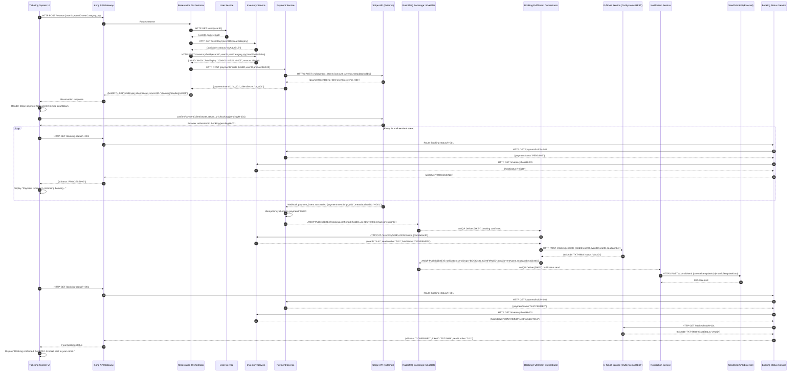
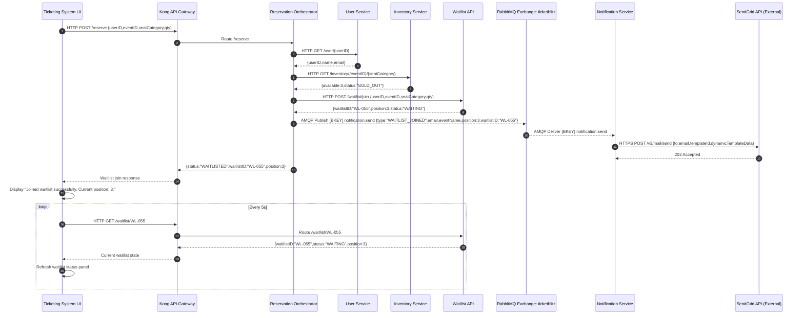
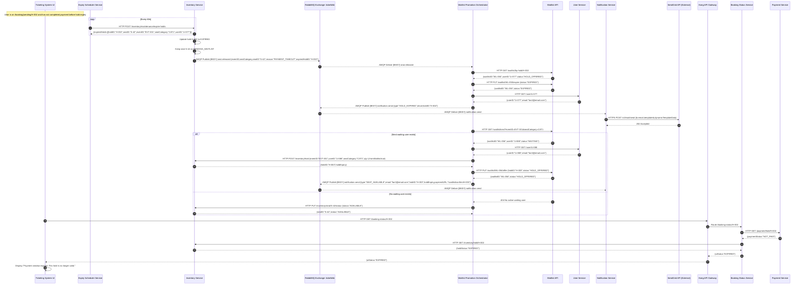

## Solution Scoping

This scenario follows the proposal template pattern of starting from a user action through a UI, then tracing the triggered microservices, external services, and business exceptions in detail.  It also fits the project’s expectation that interesting scenarios should go beyond simple UI-to-service CRUD by handling asynchronous behavior, time limits, and business exception paths.[^2][^1]

### Overall Business Scenario

TicketBlitz is a flash-sale concert ticketing platform designed to let users book tickets under extreme demand, join a FIFO waitlist when seats are exhausted, receive time-limited seat offers when inventory is released, and complete payment and ticket issuance through an asynchronous microservices flow.

### User Scenario 1

**Scenario 1: Fan Books Ticket During a Flash Sale (Async Waitlist + Timeout)**

### Design assumptions used in this revised version

- All user-facing HTTP traffic goes through **Kong API Gateway**.
- All long-running AMQP consumers and schedulers run as **separate processes/containers**, so no service needs in-process threading.
- **Booking Status Service** is a dedicated composite read service used only for UI polling after payment.
- **Waitlist API** owns the waitlist datastore; **Waitlist Promotion Orchestrator** never accesses waitlist tables directly.
- **Inventory Service** owns all inventory and hold tables; **Expiry Scheduler Service** never accesses inventory tables directly, and instead triggers Inventory maintenance through HTTP.
- **Notification Service** consumes enriched `notification.send` messages that already contain `email`, so it stays stateless.
- **E-Ticket Service** is implemented on OutSystems and exposed via **REST**, not gRPC.[^4][^5][^6]

### Scenario Summary

The scenario has four parts:

1. **Step 1A — Seats available:** Ticketing System UI reserves a seat, redirects to Stripe, then polls Booking Status Service until the UI shows a final booking success state.
2. **Step 1B — Sold out:** Ticketing System UI joins the waitlist and shows a final waitlist success state, while continuing to poll waitlist position.
3. **Step 1C — Seat released to waitlist:** a released seat is protected using `PENDING_WAITLIST`, the next waitlisted user receives a payment link, completes payment, and the UI polls until final booking success.
4. **Step 1D — Timeout:** if the waitlist offer is not paid within 10 minutes, the hold expires, the UI shows a final expired state, and the seat is either offered to the next waitlisted user or returned to public inventory.

***

## Step 1A — Happy Path

The proposal template explicitly expects microservice interaction diagrams and detailed interaction steps, so the diagram below includes URL paths, technologies, and the final UI state after backend completion.  The project also requires both HTTP and message-based communication, so this flow combines synchronous reservation with asynchronous booking confirmation and UI polling.[^1][^2]

### Microservice Interaction Diagram — Step 1A: Seats Available + Polling to Final Success

### Interaction Steps — Step 1A

1. **Start reservation request**: Ticketing System UI sends `HTTP POST /reserve` to Kong with `{userID, eventID, seatCategory, qty}`.
2. **Gateway routing**: Kong authenticates and rate-limits the request, then routes it to Reservation Orchestrator.
3. **Resolve user contact data**: Reservation Orchestrator calls `GET /user/{userID}` on User Service and retrieves `{userID, name, email}` so downstream notification events can be fully enriched without making Notification Service depend on User Service.
4. **Check current availability**: Reservation Orchestrator calls `GET /inventory/{eventID}/{seatCategory}`. Inventory Service returns only publicly available seats, excluding any seat currently marked `PENDING_WAITLIST`.
5. **Place an initial hold**: Reservation Orchestrator calls `POST /inventory/hold` with `fromWaitlist:false`. Inventory Service only allows this path to consume seats with `status='AVAILABLE'`, then atomically creates a hold and returns `{holdID, holdExpiry, amount}`.
6. **Create payment intent**: Reservation Orchestrator calls `POST /payment/initiate`. Payment Service creates a Stripe PaymentIntent and returns `{paymentIntentID, clientSecret}`.
7. **Return payment setup to UI**: Reservation Orchestrator responds to the UI with `{holdID, holdExpiry, clientSecret, returnURL}`.
8. **Render payment page**: Ticketing System UI displays the Stripe payment form and a visible 10-minute countdown tied to `holdExpiry`.
9. **Submit payment**: UI calls Stripe client-side confirmation using the `clientSecret`, and Stripe redirects the browser to `/booking/pending/{holdID}` after payment submission.
10. **Start UI polling**: The pending page begins polling `GET /booking-status/{holdID}` through Kong every 2 seconds.
11. **Return non-terminal state initially**: Booking Status Service reads Payment Service and Inventory Service. While the webhook has not completed end-to-end fulfillment, it returns `{uiStatus:"PROCESSING"}`.
12. **Receive webhook**: Stripe sends `payment_intent.succeeded` to Payment Service with the `holdID` in metadata.
13. **Apply idempotency**: Payment Service checks whether that `paymentIntentID` has already been processed. If not, it marks the transaction `SUCCEEDED`.
14. **Publish booking confirmation**: Payment Service publishes `booking.confirmed` to RabbitMQ with `{holdID, userID, eventID, email, correlationID}`.
15. **Consume confirmation asynchronously**: Booking Fulfillment Orchestrator consumes `booking.confirmed`.
16. **Confirm inventory**: Booking Fulfillment Orchestrator calls `PUT /inventory/hold/{holdID}/confirm`, which marks the hold `CONFIRMED` and the seat `SOLD`.
17. **Generate e-ticket**: Booking Fulfillment Orchestrator calls OutSystems E-Ticket Service through REST `POST /eticket/generate` and receives `{ticketID, status}`.[^5][^6][^4]
18. **Publish notification request**: Booking Fulfillment Orchestrator publishes `notification.send` with the already-resolved `email`, so Notification Service remains stateless.
19. **Send confirmation email**: Notification Service consumes the message and calls SendGrid to deliver the e-ticket notification.
20. **Return terminal status to UI**: On the next poll, Booking Status Service reads Payment Service, Inventory Service, and E-Ticket Service, derives `{uiStatus:"CONFIRMED", ticketID, seatNumber}`, and returns it to the UI.
21. **Display final success state**: Ticketing System UI displays **“Booking confirmed. Seat D12. E-ticket sent to your email.”**

***

## Step 1B — Sold Out to Waitlist

This part still follows the proposal template pattern of a user action through the UI that triggers multiple services, but the final user-visible state is a successful waitlist enrollment instead of a booking confirmation.  Because the project values user-visible inputs and outputs in the demo, this version makes the UI show a clear success page and then poll the waitlist position.[^2][^1]

### Microservice Interaction Diagram — Step 1B: Sold Out → Join Waitlist → Poll Position

### Interaction Steps — Step 1B

1. **Start reservation request**: Ticketing System UI sends `POST /reserve` through Kong.
2. **Route request**: Kong forwards to Reservation Orchestrator.
3. **Resolve user email**: Reservation Orchestrator calls User Service so later notification events can include `email`.
4. **Check inventory**: Reservation Orchestrator calls Inventory Service `GET /inventory/{eventID}/{seatCategory}`.
5. **Detect sold-out state**: Inventory Service returns `{available:0,status:"SOLD_OUT"}` because no seat is publicly bookable.
6. **Join waitlist**: Reservation Orchestrator calls `POST /waitlist/join` on Waitlist API, which inserts a FIFO entry ordered by `joinedAt` and returns `{waitlistID, position, status:"WAITING"}`.
7. **Publish waitlist notification**: Reservation Orchestrator publishes `notification.send` with `type:"WAITLIST_JOINED"` and the user’s `email`.
8. **Send waitlist email**: Notification Service consumes the event and uses SendGrid to send the waitlist acknowledgement.
9. **Return final synchronous UI result**: Reservation Orchestrator returns `{status:"WAITLISTED", waitlistID, position}` to the UI.
10. **Display final success state for Step 1B**: Ticketing System UI displays **“Joined waitlist successfully. Current position: 3.”**
11. **Optional live refresh**: The UI polls `GET /waitlist/{waitlistID}` every 5 seconds to refresh the displayed position, but the scenario is already complete from the user’s perspective once the join is acknowledged.

***

## Step 1C and 1D — Waitlist Promotion and Timeout

The project requirements explicitly highlight asynchronous request-reply and choreography as markers of more interesting scenarios, and this part is the main asynchronous core of Scenario 1.  The revised design also removes the earlier structural gap by making Waitlist Promotion Orchestrator call Waitlist API and Inventory Service over HTTP, rather than reading or writing any datastore directly, which preserves datastore ownership boundaries required by the project.[^2]

### Microservice Interaction Diagram — Step 1C: Seat Released → Protected Waitlist Promotion → Polling to Final Success

```mermaid
sequenceDiagram
    autonumber
    participant UI as Ticketing System UI
    participant INV as Inventory Service
    participant MQ as RabbitMQ Exchange: ticketblitz
    participant WPO as Waitlist Promotion Orchestrator
    participant WL as Waitlist API
    participant USER as User Service
    participant NOTIF as Notification Service
    participant SG as SendGrid API (External)
    participant Kong as Kong API Gateway
    participant RO as Reservation Orchestrator
    participant PAY as Payment Service
    participant Stripe as Stripe API (External)
    participant BFO as Booking Fulfillment Orchestrator
    participant ET as E-Ticket Service (OutSystems REST)
    participant BQS as Booking Status Service

    Note over INV: A seat is released from cancellation or expired public hold

    INV->>INV: Set seat S-42 to PENDING_WAITLIST
    INV -->> MQ: AMQP Publish [BKEY] seat.released {eventID,seatCategory,seatID:"S-42",qty:1,reason}
    MQ -->> WPO: AMQP Deliver [BKEY] seat.released

    WPO->>WL: HTTP GET /waitlist/next?eventID=EVT-301&seatCategory=CAT1
    WL-->>WPO: {waitlistID:"WL-055",userID:"U-077",position:1,status:"WAITING"}

    WPO->>USER: HTTP GET /user/U-077
    USER-->>WPO: {userID:"U-077",name,email:"fan2@email.com"}

    WPO->>INV: HTTP POST /inventory/hold {eventID:"EVT-301",userID:"U-077",seatCategory:"CAT1",qty:1,fromWaitlist:true}
    INV-->>WPO: {holdID:"H-002",holdExpiry:"2026-03-18T15:20:00Z",amount:160.00}

    WPO->>WL: HTTP PUT /waitlist/WL-055/offer {holdID:"H-002",status:"HOLD_OFFERED"}
    WL-->>WPO: {waitlistID:"WL-055",status:"HOLD_OFFERED"}

    WPO -->> MQ: AMQP Publish [BKEY] notification.send {type:"SEAT_AVAILABLE",email,holdID:"H-002",holdExpiry,paymentURL:"/waitlist/confirm/H-002"}
    MQ -->> NOTIF: AMQP Deliver [BKEY] notification.send
    NOTIF->>SG: HTTPS POST /v3/mail/send {to:email,templateId,dynamicTemplateData}
    SG-->>NOTIF: 202 Accepted

    UI->>Kong: HTTP GET /waitlist/confirm/H-002
    Kong->>RO: Route /waitlist/confirm/H-002
    RO-->>Kong: HTML/JSON to start payment for hold H-002
    Kong-->>UI: Waitlist payment page

    UI->>Kong: HTTP POST /reserve/confirm {holdID:"H-002",userID:"U-077"}
    Kong->>RO: Route /reserve/confirm
    RO->>PAY: HTTP POST /payment/initiate {holdID:"H-002",userID:"U-077",amount:160.00}
    PAY->>Stripe: HTTPS POST /v1/payment_intents {amount,currency,metadata.holdID}
    Stripe-->>PAY: {paymentIntentID:"pi_002",clientSecret:"cs_002"}
    PAY-->>RO: {paymentIntentID:"pi_002",clientSecret:"cs_002"}
    RO-->>Kong: {holdID:"H-002",clientSecret:"cs_002",returnURL:"/booking/pending/H-002"}
    Kong-->>UI: Payment setup response

    UI->>Stripe: confirmPayment(clientSecret, return_url=/booking/pending/H-002)
    Stripe-->>UI: Browser redirected to /booking/pending/H-002

    loop Every 2s until terminal state
        UI->>Kong: HTTP GET /booking-status/H-002
        Kong->>BQS: Route /booking-status/H-002
        BQS->>PAY: HTTP GET /payment/hold/H-002
        PAY-->>BQS: {paymentStatus:"PENDING"}
        BQS->>INV: HTTP GET /inventory/hold/H-002
        INV-->>BQS: {holdStatus:"HELD"}
        BQS-->>Kong: {uiStatus:"PROCESSING"}
        Kong-->>UI: {uiStatus:"PROCESSING"}
        UI->>UI: Display "Confirming waitlist booking..."
    end

    Stripe-->>PAY: Webhook payment_intent.succeeded {paymentIntentID:"pi_002",metadata.holdID:"H-002"}
    PAY->>PAY: Idempotency check on paymentIntentID
    PAY -->> MQ: AMQP Publish [BKEY] booking.confirmed {holdID:"H-002",userID:"U-077",eventID,email,correlationID}
    MQ -->> BFO: AMQP Deliver [BKEY] booking.confirmed

    BFO->>INV: HTTP PUT /inventory/hold/H-002/confirm {correlationID}
    INV-->>BFO: {seatID:"S-42",seatNumber:"D12",holdStatus:"CONFIRMED"}

    BFO->>ET: HTTP POST /eticket/generate {holdID:"H-002",userID:"U-077",eventID,seatID:"S-42",seatNumber:"D12"}
    ET-->>BFO: {ticketID:"TKT-9989",status:"VALID"}

    BFO->>WL: HTTP PUT /waitlist/WL-055/confirm {status:"CONFIRMED",holdID:"H-002"}
    WL-->>BFO: {waitlistID:"WL-055",status:"CONFIRMED"}

    BFO -->> MQ: AMQP Publish [BKEY] notification.send {type:"BOOKING_CONFIRMED",email,eventName,seatNumber:"D12",ticketID:"TKT-9989"}
    MQ -->> NOTIF: AMQP Deliver [BKEY] notification.send
    NOTIF->>SG: HTTPS POST /v3/mail/send {to:email,templateId,dynamicTemplateData}
    SG-->>NOTIF: 202 Accepted

    UI->>Kong: HTTP GET /booking-status/H-002
    Kong->>BQS: Route /booking-status/H-002
    BQS->>PAY: HTTP GET /payment/hold/H-002
    PAY-->>BQS: {paymentStatus:"SUCCEEDED"}
    BQS->>INV: HTTP GET /inventory/hold/H-002
    INV-->>BQS: {holdStatus:"CONFIRMED",seatNumber:"D12"}
    BQS->>ET: HTTP GET /eticket/hold/H-002
    ET-->>BQS: {ticketID:"TKT-9989",ticketStatus:"VALID"}
    BQS-->>Kong: {uiStatus:"CONFIRMED",ticketID:"TKT-9989",seatNumber:"D12"}
    Kong-->>UI: Final waitlist booking status
    UI->>UI: Display "Waitlist booking confirmed. Seat D12. E-ticket sent to your email."
```

### Interaction Steps — Step 1C

1. **Release trigger occurs internally**: A previously occupied or held seat becomes free due to cancellation or an earlier timeout.
2. **Protect the seat immediately**: Inventory Service sets the seat to `PENDING_WAITLIST`, not `AVAILABLE`, so new public buyers cannot see or claim it.
3. **Publish release event**: Inventory Service publishes `seat.released` to RabbitMQ.
4. **Consume release event**: Waitlist Promotion Orchestrator receives the event.
5. **Ask Waitlist API for the next eligible user**: Waitlist Promotion Orchestrator calls `GET /waitlist/next?eventID=&seatCategory=`.
6. **Receive FIFO winner**: Waitlist API returns the earliest active waiting entry.
7. **Resolve contact data**: Waitlist Promotion Orchestrator calls User Service and retrieves `{name, email}` for that user.
8. **Place protected waitlist hold**: Waitlist Promotion Orchestrator calls `POST /inventory/hold` with `fromWaitlist:true`. Inventory Service only allows this path to consume a `PENDING_WAITLIST` seat.
9. **Return waitlist hold details**: Inventory Service returns `{holdID, holdExpiry, amount}`.
10. **Mark waitlist record as offered**: Waitlist Promotion Orchestrator calls `PUT /waitlist/{waitlistID}/offer`.
11. **Publish seat-available notification**: Waitlist Promotion Orchestrator publishes `notification.send` with `type:"SEAT_AVAILABLE"`, `email`, `holdID`, `holdExpiry`, and a payment URL.
12. **Send seat-available email**: Notification Service consumes the event and SendGrid delivers the payment link.
13. **Open waitlist payment page**: Ticketing System UI loads `/waitlist/confirm/{holdID}` through Kong.
14. **Initiate payment setup**: UI posts `POST /reserve/confirm` through Kong to Reservation Orchestrator.
15. **Create payment intent**: Reservation Orchestrator calls Payment Service, which creates a Stripe PaymentIntent and returns `{clientSecret}`.
16. **Return payment data to UI**: Reservation Orchestrator returns `{holdID, clientSecret, returnURL}`.
17. **Submit payment and redirect**: UI confirms payment through Stripe, then lands on `/booking/pending/{holdID}`.
18. **Poll booking status**: UI polls Booking Status Service every 2 seconds.
19. **Return `PROCESSING` first**: Until the webhook and fulfillment finish, Booking Status Service returns `PROCESSING`.
20. **Receive webhook**: Stripe sends `payment_intent.succeeded` to Payment Service.
21. **Apply idempotency**: Payment Service processes the payment once and publishes `booking.confirmed`.
22. **Run fulfillment**: Booking Fulfillment Orchestrator confirms the hold in Inventory, generates the OutSystems ticket through REST, updates Waitlist API to `CONFIRMED`, and publishes `notification.send`.
23. **Send final confirmation email**: Notification Service sends the e-ticket email.
24. **Return terminal success to UI**: Booking Status Service eventually returns `{uiStatus:"CONFIRMED", ticketID, seatNumber}`.
25. **Display final success state**: Ticketing System UI displays **“Waitlist booking confirmed. Seat D12. E-ticket sent to your email.”**

### Microservice Interaction Diagram — Step 1D: Timeout → Expiry Scheduler → Final Expired UI State

### Interaction Steps — Step 1D

1. **Hold reaches deadline**: The user does not complete payment before `holdExpiry`.
2. **Run scheduler without threading**: Expiry Scheduler Service, running as its own worker process, periodically calls `POST /inventory/maintenance/expire-holds` on Inventory Service instead of accessing inventory tables directly.
3. **Preserve datastore ownership**: Inventory Service remains the only service that reads and writes `seats` and `seat_holds`.
4. **Expire the hold**: Inventory Service marks `H-002` as `EXPIRED`.
5. **Protect the seat again**: Inventory Service keeps the seat as `PENDING_WAITLIST`, not `AVAILABLE`, because the waitlist still has priority until checked.
6. **Publish release event**: Inventory Service publishes `seat.released` with `reason:"PAYMENT_TIMEOUT"`.
7. **Resolve the expired waitlist record**: Waitlist Promotion Orchestrator looks up the offered waitlist entry using `GET /waitlist/by-hold/{holdID}`.
8. **Expire the waitlist offer**: Waitlist Promotion Orchestrator calls `PUT /waitlist/{waitlistID}/expire`.
9. **Resolve email for notification**: Waitlist Promotion Orchestrator retrieves the user email from User Service.
10. **Publish hold-expired notification**: Waitlist Promotion Orchestrator publishes `notification.send` with `type:"HOLD_EXPIRED"`.
11. **Send expiry email**: Notification Service sends the expiry message through SendGrid.
12. **Check for another waiting user**: Waitlist Promotion Orchestrator calls `GET /waitlist/next?eventID=&seatCategory=`.
13. **Branch A — another user exists**: the orchestrator places a new protected hold using `fromWaitlist:true`, updates the new waitlist entry to `HOLD_OFFERED`, and publishes `SEAT_AVAILABLE` for the next user.
14. **Branch B — no waiting user exists**: the orchestrator calls `PUT /inventory/seat/{seatID}/status {status:"AVAILABLE"}` to return the seat to public inventory, replacing the earlier `waitlist.empty` AMQP design with direct HTTP.
15. **Return final UI state for the timed-out user**: Booking Status Service returns `{uiStatus:"EXPIRED"}` for `H-002`.
16. **Display final timeout state**: Ticketing System UI displays **“Payment window expired. This hold is no longer valid.”**

***

## API Docs, External Services, and Beyond the Labs

The proposal template sample technical overview explicitly expects service names, operations, database/storage names, and schemas, so the following tables are provided in that format.  The project requirements also require at least three atomic services, at least one OutSystems service, reuse across scenarios, HTTP communication, message-based communication, and exclusive datastore ownership.[^1][^2]

### Application / UI

| Application / UI Name | Menu Items |
| :-- | :-- |
| Ticketing System UI | Browse Events, Book Ticket, View Waitlist Status, Complete Waitlist Offer, View Booking Status |

### Atomic Microservices

| Service Name | Operations | Database / Storage | Table Name \& Schema |
| :-- | :-- | :-- | :-- |
| **User Service** | `[GET] /user/{userID}` | `ticketblitz_db` | `users`: `userID` INT PK, `name` VARCHAR(100), `email` VARCHAR(150), `phone` VARCHAR(20), `createdAt` TIMESTAMP |
| **Inventory Service** | `[GET] /inventory/{eventID}/{seatCategory}`; `[POST] /inventory/hold`; `[GET] /inventory/hold/{holdID}`; `[PUT] /inventory/hold/{holdID}/confirm`; `[PUT] /inventory/hold/{holdID}/release`; `[PUT] /inventory/seat/{seatID}/status`; `[POST] /inventory/maintenance/expire-holds` | `ticketblitz_db` | `seats`: `seatID` INT PK, `eventID` INT, `seatCategory` VARCHAR(50), `seatNumber` VARCHAR(10), `status` ENUM('AVAILABLE','PENDING_WAITLIST','HELD','SOLD'), `version` INT; `seat_holds`: `holdID` VARCHAR PK, `seatID` INT, `userID` INT, `holdExpiry` TIMESTAMP, `status` ENUM('HELD','CONFIRMED','EXPIRED','RELEASED'), `createdAt` TIMESTAMP |
| **Payment Service** | `[POST] /payment/initiate`; `[POST] /payment/webhook`; `[GET] /payment/hold/{holdID}` | `ticketblitz_db` | `transactions`: `transactionID` INT PK, `holdID` VARCHAR, `userID` INT, `amount` DECIMAL(8,2), `currency` VARCHAR(3), `stripePaymentIntentID` VARCHAR(100), `status` ENUM('PENDING','SUCCEEDED','FAILED'), `createdAt` TIMESTAMP |
| **Waitlist API** | `[POST] /waitlist/join`; `[GET] /waitlist/{waitlistID}`; `[GET] /waitlist/next?eventID=&seatCategory=`; `[GET] /waitlist/by-hold/{holdID}`; `[PUT] /waitlist/{waitlistID}/offer`; `[PUT] /waitlist/{waitlistID}/confirm`; `[PUT] /waitlist/{waitlistID}/expire` | `ticketblitz_db` | `waitlist_entries`: `waitlistID` VARCHAR PK, `eventID` INT, `userID` INT, `seatCategory` VARCHAR(50), `status` ENUM('WAITING','HOLD_OFFERED','CONFIRMED','EXPIRED'), `joinedAt` TIMESTAMP, `holdID` VARCHAR NULL |
| **Notification Service** | Consumes `[BKEY] notification.send` | No storage | Stateless consumer; sends email via SendGrid |
| **E-Ticket Service (OutSystems REST)** | `[POST] /eticket/generate`; `[GET] /eticket/hold/{holdID}` | OutSystems DB | `etickets`: `ticketID` VARCHAR PK, `holdID` VARCHAR, `userID` INT, `eventID` INT, `seatID` INT, `seatNumber` VARCHAR(10), `status` ENUM('VALID','USED','CANCELLED'), `generatedAt` DATETIME |

### Composite Services

| Service Name | Type | Operations / Trigger | Notes |
| :-- | :-- | :-- | :-- |
| **Reservation Orchestrator** | Composite | `[POST] /reserve`; `[POST] /reserve/confirm`; `[GET] /waitlist/confirm/{holdID}` | Handles pre-payment reservation flow only |
| **Booking Fulfillment Orchestrator** | Composite | Consumes `[BKEY] booking.confirmed` | Confirms seat, generates e-ticket, updates waitlist if needed, publishes final notification |
| **Booking Status Service** | Composite read service | `[GET] /booking-status/{holdID}` | Read-only UI polling facade; no database |
| **Waitlist Promotion Orchestrator** | Composite | Consumes `[BKEY] seat.released` | Promotes next waitlisted user, manages hold offers, calls Inventory/Waitlist/User over HTTP |
| **Expiry Scheduler Service** | Composite worker | Periodic call to `POST /inventory/maintenance/expire-holds` | Separate process to avoid in-service scheduler threads |

### Booking Status API contract

| Endpoint | Derived Inputs | Returned UI Status | Meaning |
| :-- | :-- | :-- | :-- |
| `[GET] /booking-status/{holdID}` | Payment + Inventory + E-Ticket | `PROCESSING` | Payment submitted or fulfillment still running |
| `[GET] /booking-status/{holdID}` | Payment + Inventory | `FAILED_PAYMENT` | Payment failed |
| `[GET] /booking-status/{holdID}` | Inventory | `EXPIRED` | Hold expired before confirmation |
| `[GET] /booking-status/{holdID}` | Payment + Inventory + E-Ticket | `CONFIRMED` | Payment succeeded, hold confirmed, ticket generated |

### AMQP model

| Exchange | Type | Binding Key | Publisher | Consumer | Payload |
| :-- | :-- | :-- | :-- | :-- | :-- |
| `ticketblitz` | Topic | `booking.confirmed` | Payment Service | Booking Fulfillment Orchestrator | `{holdID,userID,eventID,email,correlationID}` |
| `ticketblitz` | Topic | `seat.released` | Inventory Service | Waitlist Promotion Orchestrator | `{eventID,seatCategory,seatID,qty,reason,expiredHoldID?}` |
| `ticketblitz` | Topic | `notification.send` | Reservation Orchestrator, Booking Fulfillment Orchestrator, Waitlist Promotion Orchestrator | Notification Service | `{type,email,eventName,position?,holdID?,holdExpiry?,paymentURL?,seatNumber?,ticketID?}` |

### Key JSON payloads

| API / Message | Example payload |
| :-- | :-- |
| `POST /reserve` | `{ "userID": "U-001", "eventID": "EVT-301", "seatCategory": "CAT1", "qty": 1 }` |
| `POST /inventory/hold` public | `{ "eventID": "EVT-301", "userID": "U-001", "seatCategory": "CAT1", "qty": 1, "fromWaitlist": false }` |
| `POST /inventory/hold` waitlist | `{ "eventID": "EVT-301", "userID": "U-077", "seatCategory": "CAT1", "qty": 1, "fromWaitlist": true }` |
| `POST /payment/initiate` | `{ "holdID": "H-001", "userID": "U-001", "amount": 160.00 }` |
| `booking.confirmed` | `{ "holdID": "H-001", "userID": "U-001", "eventID": "EVT-301", "email": "fan@email.com", "correlationID": "corr-123" }` |
| `notification.send` booking confirmed | `{ "type": "BOOKING_CONFIRMED", "email": "fan@email.com", "eventName": "Coldplay Live", "seatNumber": "D12", "ticketID": "TKT-9988" }` |
| `notification.send` seat available | `{ "type": "SEAT_AVAILABLE", "email": "fan2@email.com", "holdID": "H-002", "holdExpiry": "2026-03-18T15:20:00Z", "paymentURL": "/waitlist/confirm/H-002" }` |

### External Services

The project requires at least one external service, and this scenario uses two external services that are directly tied to the business flow.[^2]

#### Stripe

Stripe is used for payment authorization and confirmation through PaymentIntents and a server-side webhook. It is the correct external boundary for the payment portion of this scenario because it supports asynchronous payment completion while keeping card handling outside your own services.

**APIs used**

- `POST /v1/payment_intents`
- Webhook: `payment_intent.succeeded`
- Webhook: `payment_intent.payment_failed`

**Why used here**

- Supports redirect-based payment completion from the UI.
- Supports idempotent server-side fulfillment via webhook-driven confirmation.
- Fits the flash-sale reservation model where seat confirmation must happen only after verified payment.

#### SendGrid

SendGrid is used by Notification Service for transactional email delivery.

**API used**

- `POST /v3/mail/send`

**Email types in this scenario**

- `WAITLIST_JOINED`
- `SEAT_AVAILABLE`
- `HOLD_EXPIRED`
- `BOOKING_CONFIRMED`

### Beyond the Labs

The project specification explicitly cites reasonable use of a message broker and an API gateway such as Kong as valid Beyond-the-Labs directions, and it also rewards technical choices that are clearly justified for the scenario.[^2]

#### BTL 1 — Kong API Gateway for flash-sale edge protection

Kong sits in front of all UI HTTP calls, including `POST /reserve`, `POST /reserve/confirm`, `GET /booking-status/{holdID}`, and waitlist status calls.  This is a good BTL choice because the project requirements explicitly list API gateways such as Kong as a reasonable BTL example.[^2]

**Why beneficial here**

- Rate limiting protects reservation endpoints during flash-sale spikes.
- Authentication stays at the edge.
- Polling traffic from Booking Status Service and Waitlist API is centralized behind one gateway.

#### BTL 2 — Event-driven waitlist promotion with protected inventory handoff

This scenario uses RabbitMQ beyond a trivial notification pattern by choreographing `seat.released`, `booking.confirmed`, and `notification.send` events across multiple services.  That matches the project’s emphasis on message-based communication and more interesting asynchronous scenarios.[^2]

**Why beneficial here**

- Seat release and waitlist promotion are decoupled from the original user request.
- The system can continue processing even when users are offline.
- Public buyers cannot steal a released seat because `PENDING_WAITLIST` blocks non-waitlist holds until the waitlist path is resolved.

#### BTL 3 — No-threading worker split with Booking Status polling

The final design avoids in-process threading by separating AMQP consumers and periodic schedulers into independent worker services, which is a sound fit for a Docker Compose microservices deployment.  This also avoids the complexity of sharing a blocking AMQP client inside threaded Flask processes, which is important because pika’s blocking adapter documents thread-safety constraints and only `add_callback_threadsafe` as thread-safe.[^3][^2]

**Why beneficial here**

- Reservation Orchestrator stays HTTP-only.
- Booking Fulfillment Orchestrator stays AMQP-only.
- Booking Status Service stays HTTP-only and read-only.
- Waitlist Promotion Orchestrator stays AMQP-only.
- Expiry Scheduler Service stays a separate timer-driven worker.

#### BTL 4 — OutSystems used through REST, not gRPC

OutSystems officially documents exposing REST APIs, so the E-Ticket Service boundary is correctly modeled as REST.  This is the correct structural choice for this project because it avoids inventing an unsupported or unnecessarily risky protocol boundary at the OutSystems edge.[^6][^4][^5]

**Why beneficial here**

- Keeps the OutSystems service aligned with its natural exposure model.
- Simplifies integration from Booking Fulfillment Orchestrator and Booking Status Service.
- Reduces implementation risk while preserving the required OutSystems component.[^2]

This revised Scenario 1 write-up is therefore internally consistent with the proposal template structure, the project’s microservice constraints, the no-threading requirement, the need for visible final UI states, and the corrected architectural boundaries for messaging, polling, and OutSystems integration.[^3][^4][^1][^2]

[^1]: Proposal-Template.pdf

[^2]: Project-Requirements.pdf

[^3]: https://pika.readthedocs.io/en/stable/modules/adapters/blocking.html

[^4]: https://success.outsystems.com/documentation/11/integration_with_external_systems/rest/expose_rest_apis/expose_a_rest_api/

[^5]: https://success.outsystems.com/documentation/11/integration_with_external_systems/rest/expose_rest_apis/

[^6]: https://success.outsystems.com/documentation/outsystems_developer_cloud/integration_with_external_systems/exposing_rest_apis/

